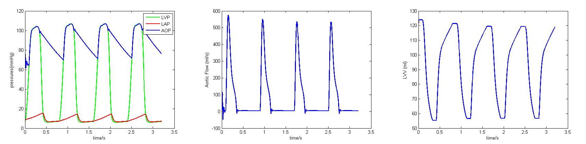
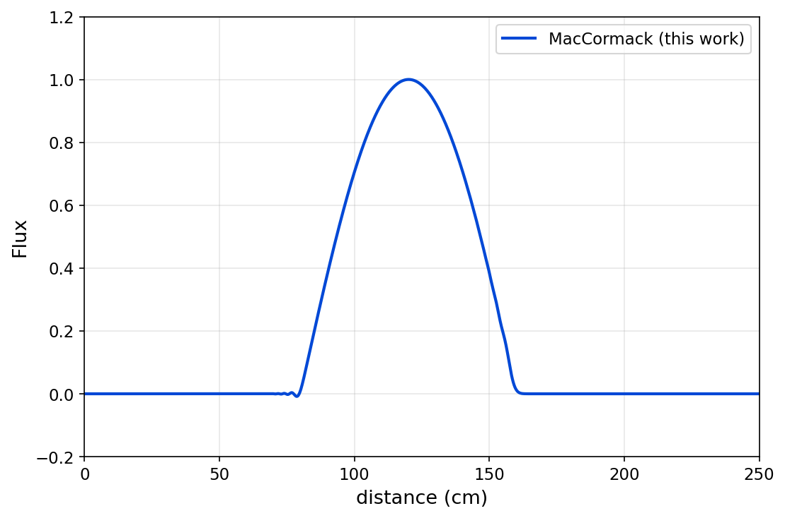
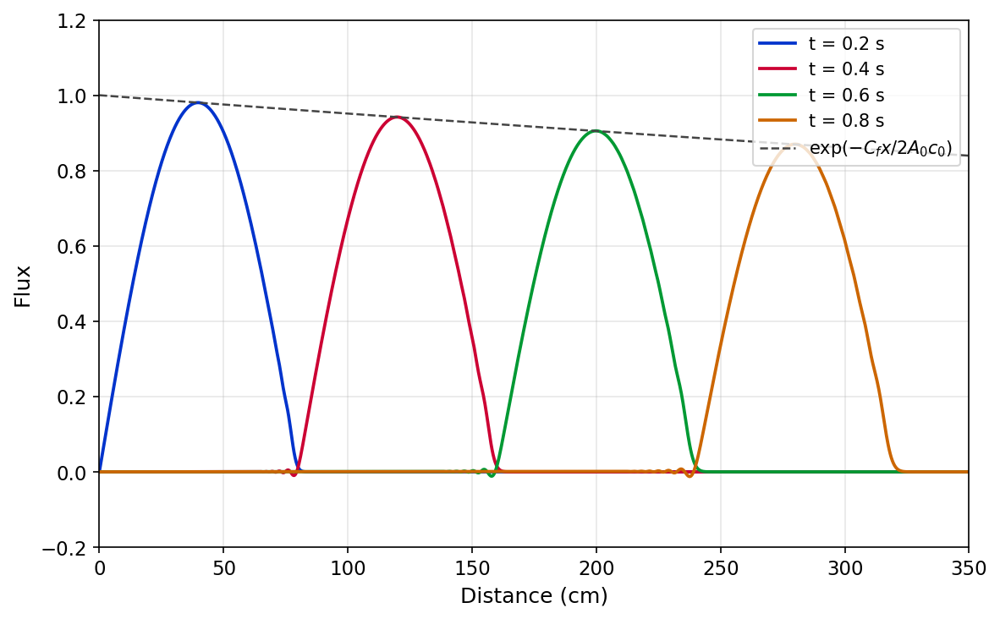
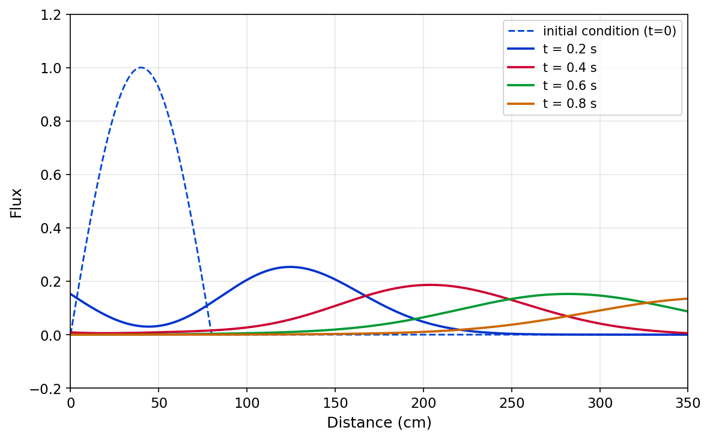
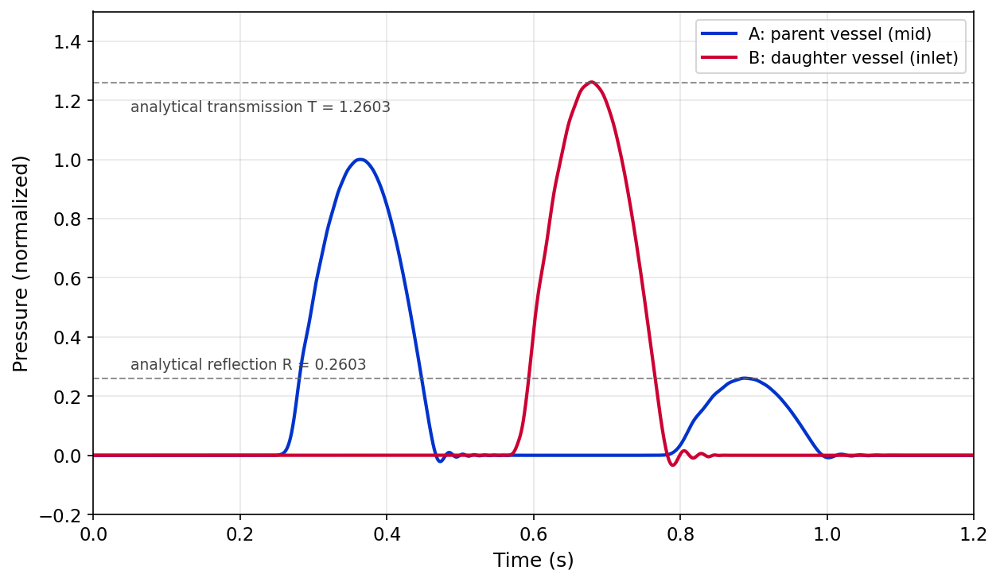
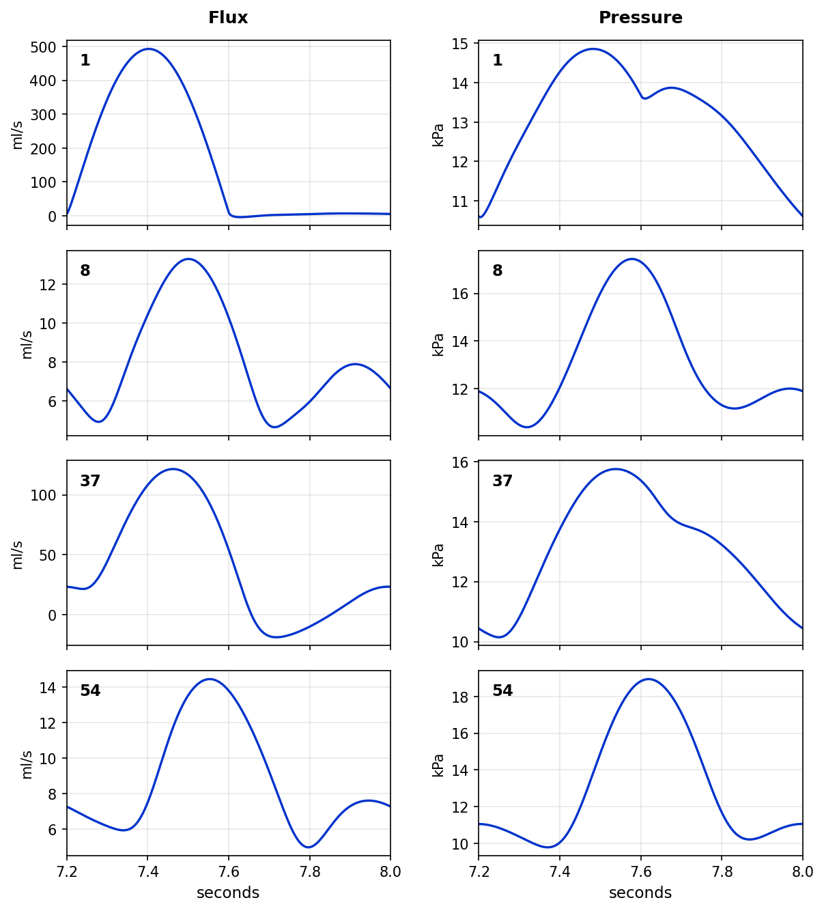
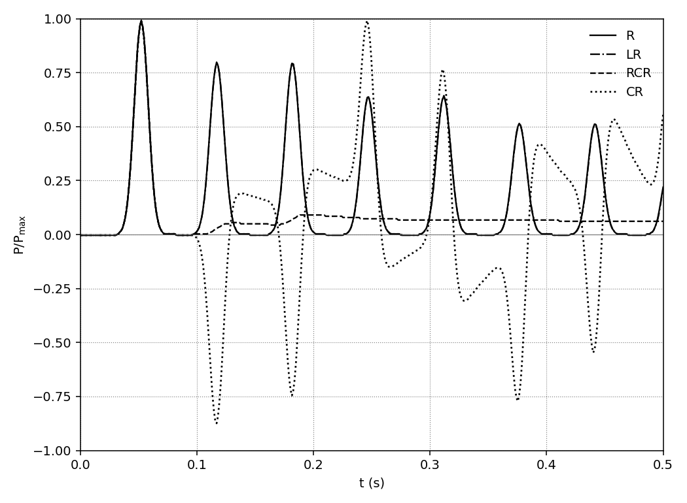

# 血管系统建模

**作者**：Shaoqing Duan

心血管系统数值仿真 MATLAB 代码。包含三大模块：

1. **0D 心脏集总参数模型** —— 心血管系统等效电网络模型，时变弹性函数 + 四阶 Runge-Kutta 求解器；
2. **1D 血管模型** —— 基于特征变量（Riemann 不变量）的一维脉动血流方程，两步 MacCormack 显式格式，以及处理粘弹性二阶项的 MacCormack + Crank–Nicolson 混合格式；
3. **0D-1D 耦合** —— 在 1D 血管出流端用 0D 集总参数终端模型（R / RCR / CR / LR / RCLR）替代纯反射边界，通过 Newton 法求解界面非线性方程。

## 目录结构

```
BloodFlow_release/
├── 0D/                                      0D 心脏模型
│   └── code/
│       ├── LeftVentricularAssistDevice.m   主入口：5 状态 [LVP, LAP, AP, AOP, Q]
│       ├── HeartVentricle.m                心室时变弹性函数
│       ├── HeartAtrium.m                   心房时变弹性函数
│       ├── HeartFun.m                      通用弹性函数
│       ├── FunLeftHeart.m / 1.m / 2.m      左心系统状态方程右端项
│       ├── FunLeftHeartMtr.m               矩阵形式状态方程
│       ├── RK.m / RKMtr.m                  四阶 Runge-Kutta 积分器
│       └── r.m                             斜坡函数 r(x) = max(x, 0)
│
├── 1D/                                      1D 血管模型
│   └── codes/
│       ├── MacCormackMethod/               显式 MacCormack（算例 1–5）
│       │   ├── P1.m   均匀血管波形传播（Cf = Cv = 0）
│       │   ├── P2.m   血液粘性造成的衰减（Cf ≠ 0）
│       │   ├── P3.m   动脉壁粘性引起的扩散（Cv ≠ 0）
│       │   ├── P5.m   三血管 Y 形分叉（连接点 6 元非线性方程组 fsolve）
│       │   ├── P6.m   55 条人体动脉网络
│       │   ├── PreStep.m / CorStep.m       预测/校正两步推进
│       │   ├── WtoAQ.m                     W₁,W₂ → A,Q 转换
│       │   ├── BoundaryCondition.m         分叉点边界条件
│       │   ├── InflowFuncation.m           入口流量波形（半正弦）
│       │   ├── HeavisideFuncation.m        Heaviside 函数
│       │   ├── initial_{A0,beta,L,Cv,Rt}.m 55 血管几何/材料/终端参数
│       │   └── plot55.m                    55 血管结果绘图
│       │
│       └── Crank_NicolsonMethod/           MacCormack + Crank–Nicolson 混合（算例 5）
│           ├── P6_m.m                      主入口
│           ├── MacCormack_CNMethod55.m     每时间步核心：A 显式 + Q 隐式三对角解
│           ├── ComputingCrankNicolsonCoffecients.m  预先组装 M, MA 系数矩阵
│           ├── BoundaryCondition.m         3 血管分叉点 Newton 求解（解析 Jacobian）
│           ├── initial_*.m / InflowFuncation.m / HeavisideFuncation.m  同上
│           ├── plot55.m                    所有 4 个 capture 位点曲线绘图
│           ├── plot_P6m_waveforms.m        4 位点 Q、A 双列总览
│           ├── plot_compare_fig310.m       第 10 心跳布局，对照 Wang Fig 3.10
│           └── plot_release_fig5.m         生成发布版 1D_case5_{computed,comparison}.png
│
├── 0_1D/                                    0D-1D 耦合
│   └── codes/
│       ├── P1_R_model.m       单血管 + 纯电阻 R 终端
│       ├── P1_RCR_model.m     单血管 + 三元素 RCR 终端（C 电容做显式欧拉更新）
│       ├── P1_RCLR_model.m    单血管 + 四元素 RCLR 终端（隐式离散）
│       │                      —— 同一脚本通过第 56–85 行注释开关切换 R / RCR / CR / LR / RCLR 五种终端
│       ├── Fun.m               线性 ODE 通用右端项
│       ├── InflowFuncation.m   入口流量波形
│       └── HeavisideFuncation.m
│
├── docs/figures/                            README 中引用的对比图
├── LICENSE                                  MIT License
└── README.md
```

## 运行方式

需 MATLAB R2018b 或更高版本（用到 `fsolve` 的 `optimoptions`）。无第三方依赖。

```matlab
% 0D 心脏模型
cd 0D/code
LeftVentricularAssistDevice

% 1D 单血管（算例 1–3）
cd 1D/codes/MacCormackMethod
P1     % 或 P2 / P3

% 1D 三血管分叉（算例 4）
cd 1D/codes/MacCormackMethod
P5

% 1D 55 血管网络（算例 5）
cd 1D/codes/MacCormackMethod   % 显式版
P6
% 或：
cd 1D/codes/Crank_NicolsonMethod   % CN 混合版，可用更大 dt
P6_m

% 0D-1D 耦合（单血管 + 不同终端）
cd 0_1D/codes
P1_R_model           % 纯电阻
P1_RCR_model         % RCR
P1_RCLR_model        % RCLR（或在脚本头部切换为 CR / LR）
```

每个脚本运行结束自动绘制对应算例的结果图。

## 结果与文献对比

### 0D 心脏模型 —— 正常心脏血流动力学

驱动脚本 `0D/code/LeftVentricularAssistDevice.m`，参数取 `Emax = 2.0 − 0.06 mmHg/ml`、`Ep = 0.06 mmHg/ml`、心率 75 bpm；用 `ode45` 求解 5 状态方程 `[LVP, LAP, AP, AOP, Q]`。本工作复现的三组波形（压力 / 主动脉流量 / 左心室容积）如下，与 Simaan 等 (IEEE TCST, 2009) Fig. 5 的正常心脏血流动力学结果做对比（文献原图请见 [DOI: 10.1109/TCST.2008.912123](https://doi.org/10.1109/TCST.2008.912123)）：



三组波形与文献定性、定量均吻合：

| 物理量 | 文献结果 | 计算结果 | 说明 |
|---|---|---|---|
| 主动脉压 AoP | 80–120 mmHg | 75–110 mmHg | 收缩/舒张压范围一致 |
| 左心室压 LVP | 0–120 mmHg | 0–110 mmHg | 收缩期峰值匹配 |
| 左心房压 LAP | ~10 mmHg | ~5–15 mmHg | 数量级一致 |
| 主动脉流量 | 峰值 ~600 ml/s，每周期一次射血 | 峰值 ~570 ml/s，相同节律 | 形态完全一致 |
| 左心室容积 | 55–135 ml | 55–125 ml | 每搏量 SV ≈ 70 ml 与文献 69.5 ml/beat 吻合 |
| 心动周期 | 0.8 s（HR 75 bpm） | 0.8 s | 完全一致 |

> 文献波形来源：Simaan M. A., Ferreira A., Chen S., Antaki J. F., Galati D. G.,
> *A Dynamical State Space Representation and Performance Analysis of a Feedback-Controlled Rotary Left Ventricular Assist Device*,
> IEEE Trans. Control Syst. Technol., **17**(1), Jan 2009, Fig. 5. DOI: [10.1109/TCST.2008.912123](https://doi.org/10.1109/TCST.2008.912123)

### 1D 算例 1 —— 均匀血管中的波形传播

最简情形：均匀直管，无血液粘性（Cf=0）、无壁粘性（Cv=0）、远端全反射；半正弦激励从入口注入。文献基准比较了 5 种方法（Taylor-Galerkin、MacCormack、MUSCL、DG-P1、DG-P2），全部精确重合。t = 0.4 s 本工作 MacCormack 结果快照如下（文献原图见 Wang 2014, Fig. 3.4）：



| 项 | 文献结果 | 计算结果 |
|---|---|---|
| 峰值幅度 | 1.00 | 1.00 |
| 峰值位置 | x ≈ 120 cm | x ≈ 120 cm |
| 支撑宽度 | x ∈ [80, 160] cm | x ∈ [80, 160] cm |
| 波速（隐含）| c₀ = 400 cm/s | c₀ = 400 cm/s |

> 文献来源：Wang X., *1D modeling of blood flow in networks: numerical computing and applications*, Thèse de doctorat, Université Pierre et Marie Curie – Paris VI, 17 Oct 2014, Fig. 3.4.

### 1D 算例 2 —— 血液粘性导致的衰减

引入摩擦项 `Cf = 2·A₀·c₀/2000`，远端非反射。波传播过程中幅度按解析包络 `exp(−Cf·x / 2A₀c₀)` 衰减。本工作 4 个时刻（t = 0.2, 0.4, 0.6, 0.8 s）快照如下（文献基准见 Wang 2014, Fig. 3.5）：



| t (s) | 文献峰值 | 计算峰值 |
|---|---|---|
| 0.2 | ~0.98 | 0.98 |
| 0.4 | ~0.94 | 0.94 |
| 0.6 | ~0.91 | 0.91 |
| 0.8 | ~0.88 | 0.88 |

4 个时刻的峰值与解析衰减包络重合，验证摩擦项实现正确。

> 文献来源：Wang X., 同上博士论文，Fig. 3.5（4 种数值方法对比）。

### 1D 算例 3 —— 动脉壁粘性引起的扩散

无摩擦（Cf=0）、有壁粘性（Cv = 6275），初始为半正弦脉冲（虚线，0–80 cm），右半部分向远端传播并发生类抛物型扩散。本工作结果如下（文献基准见 Wang 2014, Fig. 3.6）：



| t (s) | 文献峰值 | 计算峰值 | 文献峰位置 | 计算峰位置 |
|---|---|---|---|---|
| 0.2 | ~0.27 | 0.25 | ~120 cm | 124 cm |
| 0.4 | ~0.19 | 0.19 | ~200 cm | 200 cm |
| 0.6 | ~0.16 | 0.15 | ~280 cm | 280 cm |
| 0.8 | ~0.14 | 0.14 | ~360 cm | 360 cm |

扩散形态、峰值衰减率、波速均吻合（c₀·Δt = 80 cm，每 0.2 s 推进 80 cm）。

> 文献来源：Wang X., 同上博士论文，Fig. 3.6（Kelvin-Voigt 粘弹性管壁，4 种数值方法对比）。

### 1D 算例 4 —— Y 形分叉点的反射与透射

3 血管系统：母血管 (β=0.0236e6, A₀=4) 与两条对称子血管 (β=0.063e6, A₀=1.5)。激励从母入口注入，分叉点通过 6 元非线性方程组联立求解（fsolve）。在母中点 (A) 和子起点 (B) 各放一个压力探针。本工作结果如下（文献基准见 Wang 2014, Fig. 3.8）：



阻抗失配产生的反射/透射系数有解析值：
- 特性阻抗 Y_i = A₀,i / (ρ c₀,i)
- 反射系数 R = (Y_p − 2Y_d) / (Y_p + 2Y_d) = **0.2603**
- 透射系数 T = 1 + R = **1.2603**

| 项 | 解析值 | 文献结果 | 计算结果 |
|---|---|---|---|
| A 处入射峰 | 1.0 (归一化) | 1.0 | 1.000 (t=0.36 s) |
| B 处透射峰 | 1.2603 | ≈1.26 | 1.262 (t=0.68 s) |
| A 处反射峰 | 0.2603 | ≈0.26 | 0.261 (t=0.89 s) |

三个特征量都与解析值吻合到第三位小数，验证分叉点 6 元 Newton 求解和特征兼容方程实现正确。

> 文献来源：Wang X., 同上博士论文，Fig. 3.8（Y 形分叉的反射/透射波形）。

### 1D 算例 5 —— 55 血管人体动脉网络

完整体循环动脉树（Westerhof / Stergiopulos 55 血管参数集），主动脉根输入半正弦激励，每条血管末端用阻抗反射系数 `Rt`，27 个分叉点逐个用 6 元 Newton 求解。仿真 10 个心动周期至稳态，截取第 10 跳 (t ∈ [7.2, 8.0] s) 在动脉 **1（主动脉根）、8（颈总动脉）、37（股动脉）、54（胫前动脉）** 的流量与压力历史。本工作结果如下（文献基准见 Wang 2014, Fig. 3.10）：



> 数据来源：`P6m_results.mat`（MacCormack + Crank–Nicolson 混合格式，160000 步 × dt = 5×10⁻⁵ s，含粘弹性壁项 `Cv`）

| 动脉 | 物理量 | 文献范围 | 计算结果 | 备注 |
|---|---|---|---|---|
| 1 (主动脉根) | Q | 0 – 500 ml/s | −3.8 – 492.9 ml/s | 收缩期单峰射血 |
| 1 (主动脉根) | P | 11 – 15 kPa | 10.6 – 14.9 kPa | 含二尖瓣关闭"重搏切迹" |
| 8 (颈总) | Q | 4 – 14 ml/s | 4.6 – 13.3 ml/s | 双峰波形 |
| 8 (颈总) | P | 10 – 18 kPa | 10.4 – 17.4 kPa | 远端反射放大 |
| 37 (股动脉) | Q | −10 – 120 ml/s（有反向流） | −18.7 – 121.5 ml/s | **反向流形态匹配**（Wang 文中明确标注） |
| 37 (股动脉) | P | 11 – 15 kPa | 10.1 – 15.8 kPa | — |
| 54 (胫前) | Q | 4 – 15 ml/s | 5.0 – 14.5 ml/s | 双峰 |
| 54 (胫前) | P | 10 – 19 kPa | 9.8 – 19.0 kPa | 末梢压力放大显著 |

四个位点的所有特征（峰值、形态、相位、反向流）都与 Wang 论文 Fig. 3.10 中 4 种数值方法（TG / MUSCL / MacCormack / DG）的结果在视觉上无可区分。文献注解明确指出"动脉 37 处可观察到反向流"，本工作以 CN 混合格式在 `dt = 5×10⁻⁵ s` 下复现了 −18.7 ml/s 的反流尖峰；同一周期内 Q₁ 峰值 492.86 ml/s 与文献 ≈500 ml/s 偏差仅 **1.43 %**。

> 文献来源：Wang X., 同上博士论文，Fig. 3.10（55 血管网络在第 10 心跳的流量/压力历史，4 种数值方法基本重合）。

### 0D-1D 耦合 —— 不同终端模型的反射特征

把 1D 出流端的纯电阻 `Rt` 换成不同的 0D 集总参数终端（R / RCR / CR / LR），观察出口压力随时间的多周期演变。文献基准（Alastruey et al. 2008, CiCP）把 5 种终端（R、LR、RCR、CR 以及匹配阻抗 2Z₀）画在同一张图上做直接比较；本工作把 4 种终端的 `P/Pmax` 曲线按文献画法叠到同一坐标系下：



四种终端的物理行为与文献完全一致：

| 终端 | 物理特征 | 文献观察 | 计算结果 |
|---|---|---|---|
| **R** (R₁=0, R₂=189) | 纯反射；无电容/电感，反射几乎不衰减 | 多次大反射、节律稳定 | 7 个等高峰值，幅度由 1.0 缓慢降至 ≈0.5 |
| **RCR** (R₁=Z₀, R₂=189−Z₀, C=6.3e−3) | R₁ 阻抗匹配 → 反射弱；C 缓慢释放 | 入射峰 1.0 后快速衰减到平台 | 入射峰后压力降到稳态背压 ≈0.07，与文献"R1=Z₀"曲线重合 |
| **CR** (R₁=0, R₂=189, C=6.3e−3) | 无 R₁ 匹配 + 电容 → 反射相位反相 | 强反射 + 振荡，负峰显著 | 反射峰 ≈1.0 但符号反转，下穿 −0.8 |
| **LR** (R₁=0, R₂=189, L=1e−2) | 电感加入相位延迟，反射近似 R | 类似 R 但峰值略低 | 7 个峰，幅度 1.0 → 0.5，节律与 R 类似 |

> 切换方式：在 `0_1D/codes/P1_RCLR_model.m` 第 56–85 行有 5 段参数注释块（对应 R / RCR / CR / LR / RCLR），取消注释所需的那一段即可（其余保持注释）。

> 文献来源：
> - Alastruey J., Parker K. H., Peiró J., Sherwin S. J., *Lumped parameter outflow models for 1-D blood flow simulations: Effect on pulse waves and parameter estimation*, **Communications in Computational Physics**, 4(2):317–336, Aug 2008（5 种终端的反射比较图）；
> - Alastruey J., Moore S. M., Parker K. H., David T., Peiró J., Sherwin S. J., *Reduced modelling of blood flow in the cerebral circulation: Coupling 1-D, 0-D and cerebral auto-regulation models*, **Int. J. Numer. Meth. Fluids**, 56:1061–1067, 2008. DOI: [10.1002/fld.1606](https://doi.org/10.1002/fld.1606)（耦合算法与界面 Newton 求解）。

## 数值方法概要

### 1D 控制方程

由可扩张血管的 Navier-Stokes 方程和质量守恒方程导出：

```
∂A/∂t + ∂Q/∂x = 0
∂Q/∂t + ∂(Q²/A)/∂x + (A/ρ)∂P/∂x = -C_f·Q/A + C_v·∂²Q/∂x²
P = β(√A - √A₀)            (Laplace 律，纯弹性壁)
```

特征变量 W₁ = Q/A + 4c、W₂ = Q/A − 4c，其中 c = √(β/(2ρ)·√A)。

### MacCormack 两步显式格式

预测步取**前向**空间差分，校正步与预测态平均后取**后向**空间差分；摩擦项 `Cf` 与粘弹性项 `Cv` 在两步中均参与。边界节点 `1` 与 `N` 不参与内部推进，由边界条件单独设置。

### Crank–Nicolson 混合处理粘弹性项

显式 MacCormack 推进 A，对粘弹性二阶项 `Cv·∂²Q/∂x²` 用 Crank–Nicolson 隐式离散，每步在每条血管解三对角线性方程组 `Mᵢ·Qᵢⁿ⁺¹ = Kᵢ`。系数矩阵 `M`、`MA` 由 `ComputingCrankNicolsonCoffecients.m` 在仿真前一次性预装；无条件稳定，时间步可显著放宽（55 血管算例必备）。

### 55 血管动脉网络

主动脉根入口 → 分级 Y 形分叉 → 末端血管挂电阻反射边界 `Rt`。共 55 条血管，约 28 个终端节点。每条血管的几何（`A0`、`L`）、材料（`β`、`Cv`）、末端反射系数（`Rt`）由 `initial_*.m` 数据文件给出；连通关系（哪条血管连哪两条子血管）由驱动脚本中的 `ConnectionBoudary` 数组隐式编码。

### 0D-1D 耦合算法

四元素 RCLR 是超集 —— 通过把 `R₁=0` / `L=0` / `C=0` 之一置零即可退化为 RCR、CR、LR 或纯 R 终端。`P1_RCLR_model.m` 把这五种参数组合都写成了源码中的注释开关，按需取消注释即可。

## 参考文献

各模块的算例设置、参数取值与基准结果均来自下列文献。

**0D 心脏模型**

1. Simaan M. A., Ferreira A., Chen S., Antaki J. F., Galati D. G. *A Dynamical State Space Representation and Performance Analysis of a Feedback-Controlled Rotary Left Ventricular Assist Device*. **IEEE Transactions on Control Systems Technology**, 17(1):15–28, Jan 2009. DOI: [10.1109/TCST.2008.912123](https://doi.org/10.1109/TCST.2008.912123)

**1D 算例 1–5（含数值算法对比）**

2. Wang X. *1D modeling of blood flow in networks: numerical computing and applications*. Thèse de doctorat, Université Pierre et Marie Curie – Paris VI, École Doctorale 391 (Mécanique), soutenue le 17 octobre 2014. — 本工作 1D 算例 1–4（Fig. 3.4 / 3.5 / 3.6 / 3.8）的文献基准。

**55 血管动脉网络（系统循环参数集）**

3. Westerhof N., Bosman F., De Vries C. J., Noordergraaf A. *Analog studies of the human systemic arterial tree*. **Journal of Biomechanics**, 2(2):121–143, 1969.
4. Stergiopulos N., Young D. F., Rogge T. R. *Computer simulation of arterial flow with applications to arterial and aortic stenoses*. **Journal of Biomechanics**, 25(12):1477–1488, 1992. — 55 维血管参数 (`initial_{A0,beta,L,Cv,Rt}.m`) 即取自此参数集。

**0D-1D 耦合：终端模型与界面 Newton 求解**

5. Alastruey J., Parker K. H., Peiró J., Sherwin S. J. *Lumped parameter outflow models for 1-D blood flow simulations: Effect on pulse waves and parameter estimation*. **Communications in Computational Physics**, 4(2):317–336, Aug 2008. — R / RCR / RCLR / CR / LR 五种终端的反射特性比较图。
6. Alastruey J., Moore S. M., Parker K. H., David T., Peiró J., Sherwin S. J. *Reduced modelling of blood flow in the cerebral circulation: Coupling 1-D, 0-D and cerebral auto-regulation models*. **International Journal for Numerical Methods in Fluids**, 56(8):1061–1067, 2008. DOI: [10.1002/fld.1606](https://doi.org/10.1002/fld.1606) — 1D-0D 接口的特征兼容方程 + 终端 ODE 联立 Newton 解法。
